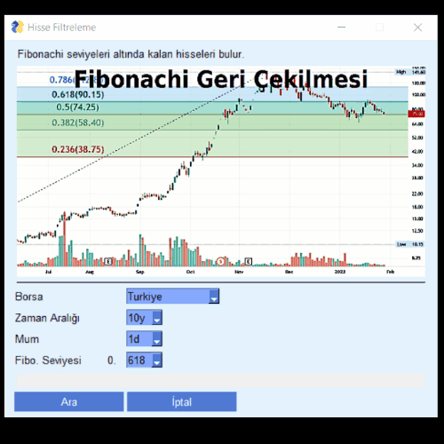

# Hisse filtreleme

Fibonacci Geri çekilmesi seviyelerine göre hisse filtreleme yapabilirsiniz.

Fibonachi seviyeleri altında kalan hisseleri bulur.

_İyi bir internet hızınız varsa_, her hissenin kontrolü ortalama 0,25 saniye sürer.

Sonuçlar Excel (CSV) dosyası halinde verilir.

## İçindekiler

- [Özellikler](#ozellikler)
- [Kurulum](#kurulum)
- [Kullanım](#kullanim)
- [Seçenek Kodları](#kodlar)
  - [Ülke BORSA kodları](#ulke)
  - [Periyodlar](#periyodlar)
  - [Mumlar](#mumlar)
- [Linkler](#linkler)

<h2 id="ozellikler">Özellikler</h2>

- Otomatik kapanış açılış yüksek ve düşük değerlerini düzeltme
- Eksik veri ve karışıklıkları düzeltme
- Günlük aralıklarla veri çekilmesi
- Sorgunun yapılacağı mumların seçimi
- Borsalardan kaldırılmış hisseleri bulma seçeneği

## Kurulum

<h2 id="kullanim">Kullanım</h2>

---

**Örneğin**:

 `python .\main.py -b de -p 5y`

 Almanya borsasında 5 yıllık veriler içinde arama yapar, **data** klasörü içinde **uyumlu-de.csv** dosyasını oluşturup, içine sonuçları yazar.

---

## Kodlar

<h3 id="ulke"> Ülke/BORSA kodları</h3>

| Ülke | kod|adet|
-------|----|----|
| Norveç |no|22|
| İspanya | es |6|
| Yunanistan |gr |35|
| Almanya |de |25|
| BIST |tr |518|
| NASDAQ |nas |4689|
| Tüm Hisseler ! |all |8025|

**NOT**: _all_ seçeneğinin sonuç bulması yaklaşık 45 dakika sürüyor

### Periyodlar

| Aralık | kod|
|----------|----|
| Günlük   |1d|
| 5 Günlük | 5d |
| Aylık    |1mo |
| 3 Aylık  |3mo |
| 6 Aylık  |6mo |
| Yıllık   |1y |
| 2 Yıllık |2y |
| 5 Yıllık |5y |
| 10 Yıllık|10y |
| 15 Yıllık|15y |
| geçen yıl bu zamandan itibaren |ytd |
| Tüm geçmiş veriler |max |

### Mumlar

_Verilerin hangi aralıklarla çekildiği Fibonacci için gerekli değil ancak ilerde gerekebilir._

| Mum  | kod|
|----------|---|
| Yarım Saat |30m|
| Saatlik |60m|
| 1,5 Saatlik |90m|
| Günlük  |1d |
| 5 Günlük   |5d |
| Haftalık |1wk |
| Aylık |1mo |
| 3 Aylık|3mo |

### Linkler

[yfinance dökümanları](https://openbase.com/python/yfinance/documentation)

Sembolleri bulmak için:
[Borsalardan işlem gören hisse listelerinin CSV halleri](https://www.nasdaq.com/market-activity/stocks/screener)

TODO:

[RSI hesaplama](https://www.alpharithms.com/relative-strength-index-rsi-in-python-470209/)
